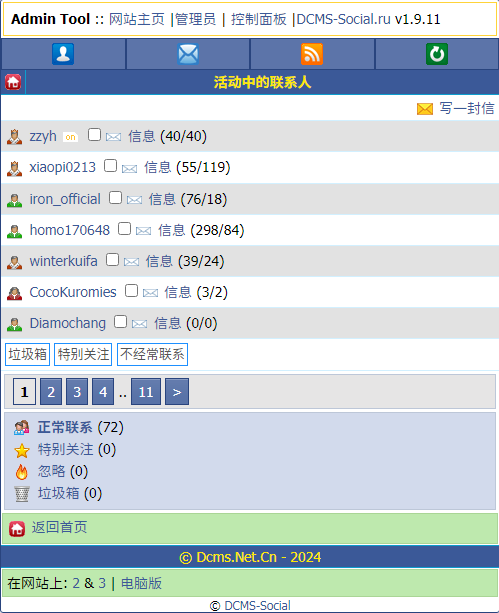

# 功能介绍

CDS主要功能包括:聊天社交,论坛讨论;影音储存,日记交流;

- [功能介绍](#功能介绍)
  - [主页:](#主页)
  - [个人主页](#个人主页)
  - [信息页](#信息页)

以默认主题为例

## 主页:

LOGO下为管理工具(仅管理员)

上方四个图标为一行的为CDS的操作栏,从左到右为 个人主页 信息 消息中心 刷新界面
>无论在哪个页面,操作栏都会一直存在,方便使用

操作栏之下为网站状态显示,显示当前网站上的游客与用户

网站状态下面是功能栏,根据排列顺序进行介绍

 - 新闻中心 : 也就是公告中心,可查看以前的公告/新闻

 - 资源库 : 类似于网盘,可从个人文件夹上传
 >现因服务器储存空间不足,已关闭上传

 - 领导者(现以纠正翻译为领袖) : 可使用硬币让自己在在线页面突出展示

 - 网站论坛 : 现有八个大板块与诸多小板块

 - 聊天室 : 包含了全民答题,可获取积分兑换硬币

 - 日记 : 用户的日记/记录/文章

 - 留言板 : 留言板,但不支持游客留言

 - 照片墙 : 所有用户的相册列表

 - 开心农场 : CDS的插件游戏,但仍然有小Bug

 - 用户列表 : 全用户列表,可以快速查询某人

 - 网站资料与帮助 : 如名

 - GitHub/Gitee开源地址 : 如名

 - 站长之家 : 站长/热心网友的另一个WAP社区交流网站

 - 网站管理 : 管理员区,可审查投诉以及管理员聊天室

 往下为论坛&日记的最新列表,可快速查看

## 个人主页

>查看个人主页

>查看他人主页

导航栏下为个人资料(管理员会显示职位)

展示收到的礼物,个人状态,在线状态,头像,评级徽章

音乐 : 在文件中点击添加到音乐,在进入菜单后可播放音乐

帖子与评论 : 查看该用户在论坛发布的所有帖子与在其他帖子的评论

日记&书签&评价 : 查看全部

额外服务 : 将积分兑换为硬币&可使用硬币开启 5+ 评分 与 领袖服务

赠送硬币&赠送礼物 : 如名

个人设置 : 用户设置/通知设置/隐私设置

登录历史 : 如名

动态 : 可查看该用户更换的头像,发布的帖子&日记,动态留言

## 信息页

写一封信 : 给制定用户名用户发送一条信息

下面为最近的联系人列表,点击小信封图标即可进入聊天详情
